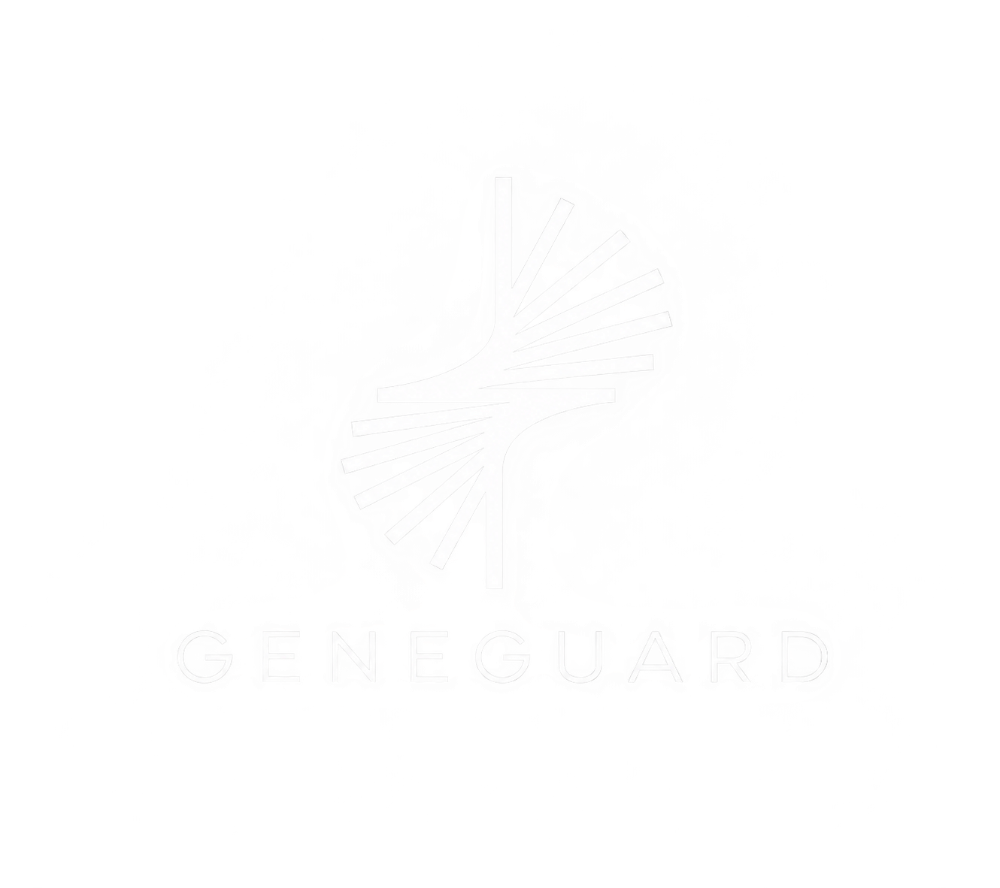

🧬 GeneGuard

AI-Powered Genetic & Family Health Analysis

Personal health • Disease-specific ML • Family risk • Medical RAG

 

 

GeneGuard brings disease-specific machine learning, family-health context, medical report extraction, and medical knowledge retrieval into one platform.

✦ What is GeneGuard?

GeneGuard is an AI/ML healthcare research platform designed to analyze personal health information alongside family medical history.

Instead of relying on one universal model, GeneGuard uses individual disease-specific models, allowing each model to work with the features and preprocessing appropriate to its own prediction task.

                    ┌──────────────────────┐
                    │      GENE GUARD       │
                    └──────────┬───────────┘
                               │
          ┌────────────────────┼────────────────────┐
          │                    │                    │
          ▼                    ▼                    ▼
   Personal Health       Family Health        Medical Reports
          │                    │                    │
          └────────────────────┼────────────────────┘
                               ▼
                  Disease-Specific ML Models
                               │
          ┌────────────┬───────┼───────┬────────────┐
          ▼            ▼       ▼       ▼            ▼
      ❤️ Cardio    🩸 Metabolic  🩺 BP  🦋 Thyroid  🧬 Cancer
          │            │       │       │            │
          └────────────┴───────┼───────┴────────────┘
                               ▼
                       Family Risk Engine
                               ▼
                       Final Analysis
                               ▼
                    Gemini Interpretation

🧠 Disease-Specific Machine Learning

GeneGuard is built around separate ML pipelines for different health domains.

Model

Purpose

Example Inputs

❤️ Cardiovascular

Cardiovascular classification

Age, sex, BP, cholesterol, ECG, chest pain, max HR

🩸 Metabolic

Metabolic disease analysis

Glucose, HbA1c, lipids, insulin, HOMA-IR, BMI

🩺 Hypertension

Blood-pressure analysis

Systolic/diastolic BP, age, BMI, HR, validated health features

🦋 Thyroid

Thyroid classification

TSH, T3, T4, T4U, FTI, medication, goitre

🧬 Hereditary Cancer

Cancer/hereditary-risk analysis

Age, genetic-risk indicators, exposures, symptoms

Why separate models?

                 Health Data
                     │
                     ▼
               Feature Mapping
                     │
       ┌─────────────┼─────────────┐
       ▼             ▼             ▼
   Cardio Model  Thyroid Model  Cancer Model
       │             │             │
       ▼             ▼             ▼
   Cardio Output  Thyroid Output  Cancer Output

A model receives only the features relevant to its trained schema.

❤️ Cardiovascular Model

The cardiovascular module uses a dedicated tabular ML pipeline.

Main features

age · sex · cp · trestbps · chol · fbs · restecg · thalch · exang · oldpeak · slope · ca · thal

Tuned Random Forest

n_estimators      = 200
max_depth         = 10
min_samples_leaf  = 2
min_samples_split = 2

Recorded evaluation:

Metric

Result

Accuracy

73.90%

Precision

77.44%

Recall

66.51%

F1 Score

71.56%

ROC-AUC

80.22%

These are research/prototype evaluation results and are not clinical validation.

🩸 Metabolic Disease Model

GeneGuard includes a separate metabolic model built around metabolic health indicators.

Feature space can include

Glucose

HbA1c

Total cholesterol

LDL

HDL

Triglycerides

Fasting insulin

HOMA-IR

BMI

Body measurements

Other features supported by the trained model

The metabolic model maintains its own feature schema and preprocessing pipeline.

🩺 Hypertension Model

A dedicated hypertension/blood-pressure model handles blood-pressure-related analysis.

Relevant information can include

Systolic blood pressure

Diastolic blood pressure

Age

Sex

BMI

Resting heart rate

Metabolic indicators

Smoking/activity variables where supported

Relevant medical history

Hypertension Model
        ≠
Cardiovascular Model

They may use overlapping information, but they represent different prediction tasks.

🦋 Thyroid Disease Model

GeneGuard includes an independent thyroid classification model.

Thyroid feature space

TSH

T3

T4

T4U

FTI

Thyroxine medication

Antithyroid medication

Goitre

Thyroid surgery

Hypothyroidism / hyperthyroidism query fields

Pregnancy-related fields

Other thyroid-dataset indicators

⚠️ Development Note

The thyroid module has included experimentation with synthetic training data. Extremely high results from those experiments must not be interpreted as clinical accuracy.

The intended production approach is a reproducible pipeline using the actual thyroid dataset, preprocessing, and trained model artifact.

🧬 Hereditary Cancer Model

GeneGuard contains a dedicated cancer/hereditary-risk module.

Example feature categories

Age

Gender

Genetic-risk indicator

Smoking

Passive smoking

Alcohol exposure

Obesity

Occupational hazards

Chronic disease indicators

Chronic fatigue

Unexplained weight loss

Shortness of breath

Wheezing

Persistent cough

Coughing blood

Swallowing difficulty

Clubbing

The platform is designed to support hereditary cancer categories such as:

BRCA1/BRCA2-related hereditary cancer · Lynch syndrome · Familial adenomatous polyposis

The exact target and feature schema remain specific to the trained model.

👨‍👩‍👧‍👦 Family Health Network

GeneGuard lets users build an interactive family-health network.

                  Grandfather
                       │
                    Father
                       │
        Brother ───── Me ───── Mother
                                 │
                         Maternal Grandfather

Family members can contain:

Relationship

Age / age at death

Sex

Alive / deceased / unknown

Diagnosed conditions

Age at diagnosis

Symptoms

Health information

Optional medical reports

Unknown ≠ No

Unknown medical information is represented as:

null / unknown

It is not automatically converted to 0.

📊 Family Risk Engine

GeneGuard separates personal model output from family-aware analysis.

Personal prediction

Personal Health Data
        ↓
Disease Model
        ↓
P(personal)

Family-aware calculation

P(personal)
     +
Validated Family Evidence / Model
     ↓
Family Risk Engine
     ↓
P(family-aware)
     ↓
Change in percentage points

The system does not arbitrarily add a percentage because a parent or grandparent has a disease.

If a validated family-aware mechanism is unavailable, GeneGuard does not fabricate a numerical adjustment.

📄 Medical Report Intelligence

Medical reports can be supplied as PDF, JPG, or PNG.

PDF / Image
    ↓
OCR / Document Extraction
    ↓
Test Identification
    ↓
Value + Unit Extraction
    ↓
Normalization
    ↓
User Verification
    ↓
Structured Health Data
    ↓
Disease-Specific Models

Report extraction is data extraction — not disease prediction.

One report can provide information to multiple models, but each model receives only the fields relevant to its trained feature schema.

🩺 Medical RAG Chatbot

GeneGuard also includes a Medical Retrieval-Augmented Generation chatbot powered by the Gale Encyclopedia of Medicine.

The chatbot does not directly fine-tune the LLM on the book.

Instead, medical knowledge is converted into vector embeddings, stored in Pinecone, and retrieved when a user asks a question.

🔬 RAG Pipeline

        Gale Encyclopedia of Medicine
                    │
                    ▼
             Text Extraction
                    │
                    ▼
        Recursive Text Chunking
                    │
                    ▼
       Hugging Face Embeddings
          all-MiniLM-L6-v2
                    │
                    ▼
            384D Embeddings
                    │
                    ▼
               Pinecone
            Vector Database
                    │
                    ▼
             Semantic Search
          Cosine Similarity
                    │
                    ▼
          Relevant Medical Context
                    │
                    ▼
               OpenAI LLM
                    │
                    ▼
             Chatbot Response

Core techniques

Technique

Role

RAG

Retrieves knowledge before generation

Recursive Text Splitting

Creates searchable chunks

all-MiniLM-L6-v2

Generates 384D sentence embeddings

Pinecone

Stores and indexes vectors

Semantic Search

Finds meaningfully relevant context

Cosine Similarity

Measures vector similarity

LangChain

Connects the RAG pipeline

OpenAI LLM

Generates the final response

Flask

Provides the chatbot backend/interface

🤖 AI Layers

GeneGuard separates numerical ML, family analysis, interpretation, and medical knowledge retrieval.

┌───────────────────────────────────────────────┐
│          DISEASE-SPECIFIC ML MODELS           │
│              Numerical Outputs                │
└───────────────────────┬───────────────────────┘
                        ▼
┌───────────────────────────────────────────────┐
│              FAMILY RISK ENGINE               │
│       Validated family-aware calculations     │
└───────────────────────┬───────────────────────┘
                        ▼
┌───────────────────────────────────────────────┐
│                 GEMINI                        │
│       Interpretation & Explanation            │
└───────────────────────────────────────────────┘

For medical questions:

User Question
      ↓
Query Embedding
      ↓
Pinecone Retrieval
      ↓
Medical Context
      ↓
OpenAI LLM
      ↓
RAG Response

Gemini does not replace the ML models or invent their numerical outputs.

📴 Offline ML Capability

One of GeneGuard's important architectural features is that the trained disease-specific model artifacts are stored inside the project.

Once the project and required dependencies are installed, the core ML inference can run locally without an internet connection.

┌─────────────────────────────┐
│     Local GeneGuard App     │
└──────────────┬──────────────┘
               ▼
        Local Health Data
               ▼
       Local Preprocessing
               ▼
       Trained Local Model
               ▼
        Local Prediction

What can run offline?

The locally stored trained ML models can perform their inference without relying on an external ML API.

What still needs internet?

Cloud-dependent features may require an internet connection:

Gemini API interpretation

OpenAI-powered RAG generation

Pinecone vector retrieval

Vercel deployment

Other external APIs/services

So the ML inference layer is locally executable, while cloud AI/RAG features remain network-dependent.

✨ Key Features

<table>
<tr>
<td>🧬 <b>Personal Health</b> Structured health profile and measurements</td>
<td>👨‍👩‍👧 <b>Family Network</b> Interactive family health relationships</td>
</tr>
<tr>
<td>❤️ <b>Multiple ML Models</b> Disease-specific prediction pipelines</td>
<td>📄 <b>Medical Reports</b> Extract and verify laboratory data</td>
</tr>
<tr>
<td>📊 <b>Family Risk</b> Validated family-aware analysis</td>
<td>🩺 <b>Medical RAG</b> Knowledge retrieval from medical literature</td>
</tr>
<tr>
<td>🤖 <b>AI Interpretation</b> Gemini-based final explanation</td>
<td>📴 <b>Offline ML</b> Local trained-model inference</td>
</tr>
</table>

🛠️ Technology Stack

Machine Learning

Python · Pandas · NumPy · Scikit-learn · Random Forest · LightGBM · TensorFlow/Keras · SHAP

Medical RAG

LangChain · Pinecone · Hugging Face · all-MiniLM-L6-v2 · OpenAI · Vector Embeddings · Cosine Similarity

Application

React · Flask · Python APIs · Vercel

AI

Disease-specific ML · Family Risk Engine · Gemini · RAG

⚙️ End-to-End Workflow

                     USER
                      │
                      ▼
             Personal Health Data
                      │
                      ▼
             Build Family Network
                      │
                      ▼
             Upload Medical Reports
                      │
                      ▼
             Verify Extracted Data
                      │
                      ▼
          ┌────────────────────────┐
          │ Disease-Specific Models│
          └────────────┬───────────┘
                       ▼
                Model Outputs
                       │
                       ▼
              Family Risk Engine
                       │
                       ▼
                Final Analysis
                       │
                       ▼
              Gemini Interpretation
                       │
                       ▼
               GeneGuard Report

🔐 Responsible AI Principles

GeneGuard follows several implementation principles:

Disease models remain separate.

Models only receive features from their trained schemas.

Unknown does not automatically mean zero.

Medical reports are verified before model use.

ML probabilities are not manually altered.

Family-history effects are not assigned arbitrary percentages.

Gemini is an interpretation layer, not the numerical ML engine.

RAG retrieves medical knowledge instead of fine-tuning the LLM on the encyclopedia.

📈 Project Focus

GeneGuard explores how multiple AI techniques can work together in a health-analysis platform:

Traditional ML
      +
Medical Data Processing
      +
Family History Modeling
      +
Vector Search
      +
RAG
      +
LLMs
      +
Explainability
      ↓
   GeneGuard

🌐 Live Demo

🧬 Try GeneGuard

https://gene-guard-2-0-frontend.vercel.app/

⚠️ Disclaimer

GeneGuard is a research and educational project.

Its machine-learning predictions, family-history analysis, medical-report extraction, and chatbot responses are not a substitute for professional medical diagnosis, treatment, or clinical decision-making.

🧬 GeneGuard

AI Genetic & Family Health Analysis

Built with Python · React · ML · RAG · LLMs

⭐ Explore the project. Build. Research. Learn.

